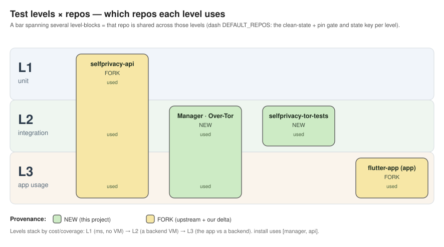
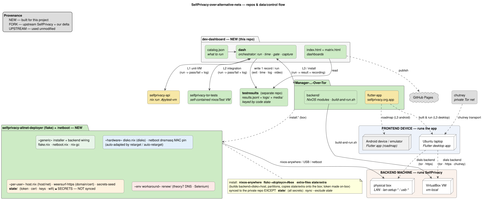

# SelfPrivacy dev dashboard

- **Live:** `https://selfprivacy-over-alternative-nets.github.io/dev-dashboard/`
- **Local (with videos & raw logs):** `./dash serve` → http://localhost:8099/

### Test Levels (also explained in-page)

- **L1 — unit:** pure Python logic in the API (onion/URL routing). No VM, no network. Milliseconds.
- **L2 — integration:** a real NixOS backend boots in the automated test-VM; routing checked per
  network. No app.
- **L3 — app usage:** the SelfPrivacy app is driven like a user (open → Providers→Services→back →
  add a service …) against a running backend, and **screen-recorded**.




<!-- levels.svg is generated by docs/gen_levels.py (pure stdlib, deterministic) via the same
     docs/render-diagrams.sh pipeline as architecture.svg — edit the .py, not the .svg. -->


## Architecture — the repos and how they connect



## Filling the test matrix

### Install a backend (do this first for L2/L3)

```bash
# local VirtualBox VM (no external hardware):
./dash run install.vm-local --on vm-local
```
Install over lan:
```sh
# First reboot the target device into network mode, it will display its mac in ipv4 mode. 
# Then on this device you need to start some service that hands out IP adresses to lan-connected devices:
  sudo bash ~/netboot/start-netboot-server.sh # and keep it running.

# Then in another terminal run:
./dash find-target # That should let you see which device is the target, it will output the mac and ip you need to use like:

# Install SelfPrivacy backend to target:
./dash run install.lan-setup-0 \
  --ip 192.168.100.50 \
  --key ~/.ssh/pcname_ed25519 \
  --env FLAKE=/home/a/git/personal/selfprivacy/selfprivacy-altnet-deployer \
  --env MAC=d8:cb:8a:7c:0a:f4 \
  --env DOMAIN=weersurf.nl \
  --env NETBOOT=auto \
  --env TRANSPORT=none
```

Targeting a **different** device? Run `tools/retarget_device.sh` once (it rewrites the netboot MAC
pin + `disko.nix` from the target's own hardware) — see `../selfprivacy-altnet-deployer/INSTALL.md §3`.

### Run tests

```bash
./dash run L1.onion-routing                              # unit VM, no network, no box
./dash run L2.backend --net tor                          # self-contained backend test-VM (tor | https)
./dash run L3.connect.desktop --net tor --on vm-local    # app vs the local VM backend
# app vs a deployed box (box setups need --ip/--key/--token; the token is the box's API token):
./dash run L3.connect.desktop --net https --on lan-setup-0b \
  --ip 192.168.1.167 --key ~/.ssh/pcname_ed25519 \
  --token 217027b3e45f737e9f02d04ed80f350750b7c576be635ff3051df9b7bf32c785
```

Run a whole group at once by listing ids: `./dash run L3.connect.desktop L3.login.desktop … --net … --on …`.
Record a manual/USB/click-through result instead: `./dash report <id> --status pass --duration <s> [--net … --on …]`.

Before the first L3 flow on a freshly-installed backend, bless its clean baseline so later flows' drift
is measured (req 90): `./dash l3-baseline capture --on vm-local` (box: add `--ip/--key/--token`).

### Inspect results locally (with videos + raw logs)

```bash
./dash serve        # prints both:  http://localhost:8099/  (per-run)  and  …/matrix.html  (grid)
```

Hover a ☐ cell for its exact command (copy button); click a status dot for that run's log, screenshots
and video; the left sidebar switches between code states.

### Publish

```bash
./dash publish      # commits results.jsonl + logs + screenshots INSIDE the testresults repo and pushes
```

Videos are git-ignored (local only); the code repos are untouched. GitHub Pages redeploys on push.


## Data model

One JSON record per run, appended to **`testresults/results.jsonl`** (falls back to `data/results.jsonl`
if the `testresults` repo isn't cloned alongside). Fields, grouped:

```
identity    run_id · ts · env(local|ci) · host · source(automated|manual)
catalog     id · name · level · client · category · transport(network) · method(setup) · backend
code state  repos[]{name,branch,commit,dirty,diff_hash} · pins{api,nixpkgs,manager}
            state_hash (repo combo) · state_id (= state_hash + build closure) · closure/drv
result      status(pass|slow|fail) · duration_s · exit_code · error · artifacts{client_log,server_log,video,screenshots}
integrity   dirty · behind_upstream · pin_mismatch · forced/forced_reasons · from_cache · substituted · flaky
            guard_files[] · hermetic/hermetic_problems · nix_sandbox · impure            (hidden-input & build-purity)
box run     box_stamp · box_live · box_stale · box_state_hash · box_method · box_method_mismatch
L3 baseline l3_baseline_match · l3_baseline_drift · l3_restored · l3_state_uncovered · l3_pre_sha · l3_post_sha
```

`status`: exit 0 → pass, exit 0 but over the catalog `budget_s` → slow, else fail. `env` is `ci` when
`$CI`/`$GITHUB_ACTIONS` is set. The sidebar groups runs by `state_hash` (the whole repo-commit combo);
`closure`/`state_id` distinguish two builds that share commits but differ in a transitive input.

## Publishing & security

`.github/workflows/pages.yml` deploys on every push to `main` (auto-enables Pages on first run).
Raw logs (`logs/*.log`, `*.server.log`) and videos (`media/`) are **git-ignored** — kept local, since
they can contain live `.onion` addresses — so media links work under `./dash serve`, not on Pages.
Published error summaries have `.onion` scrubbed to `<onion>`.

## Safety checks (before running on untrusted / café wifi)

`dash serve` binds **`127.0.0.1:8099`** by default (override with `DASH_HOST=0.0.0.0` to share
intentionally) and serves this whole dir — `logs/`, `media/`, `results.jsonl` — which can contain live
`.onion`s and tokens. The chutney test-net still binds `0.0.0.0:7100–7108`. So if you set
`DASH_HOST=0.0.0.0` or run chutney on a shared network, these are reachable by anyone **unless** a
firewall blocks them. Check first:

```bash
# 1. What is reachable from the LAN? (anything NOT on 127.x / ::1)
ss -ltn | awk 'NR>1 && $4 !~ /^127\.|^\[::1\]/ {print $4}'

# 2. Is the firewall actually on? (want: "Status: active", default deny incoming)
sudo ufw status verbose
```

Harden — pick **A** (firewall) or **B** (bind to loopback):

```bash
# A) turn the firewall on (default-deny inbound; safe here — no host service needs inbound)
sudo ufw default deny incoming && sudo ufw default allow outgoing && sudo ufw enable

# B) bind services to loopback instead
#   dash:  already loopback by default (don't set DASH_HOST=0.0.0.0)
#   VM ssh forward → loopback (tunnel still works via localhost):
VBoxManage controlvm "SelfPrivacy-Tor-Test" natpf1 delete ssh
VBoxManage controlvm "SelfPrivacy-Tor-Test" natpf1 "ssh,tcp,127.0.0.1,2222,,22"
#   chutney: only run on a trusted network (relays bind 0.0.0.0:7100-7108)
```

**Don't run `dash serve` or the chutney net on public wifi without A or B.** After hardening, re-check with
command 1 — it should print nothing outside `127.x`.

> `setup-theory7-https.sh` installs a local **mkcert** root CA (system + Firefox) — browser-trusted HTTPS for
> the VM (`https://theory7.weersurf.nl`). Guard `~/.local/share/mkcert/rootCA-key.pem` (never copy/sync it);
> `mkcert -uninstall` to revoke. See `../handover2.md`.

## Integrity — why a green cell is trustworthy

The point of the harness is that **a pass means the committed code of the recorded state actually ran**
— any divergence is detected and the run refused (or flagged), never a silent green. Full spec:
`testresults/test_requirements.md` (numbered). In short, before/around a run `dash` checks:

- **Clean state** — every repo a test uses is committed + in sync (incl. submodule-pointer drift), not
  just the primary one; gitignored build-affecting files (`guard_paths`) that `git status` can't see
  are surfaced.
- **Right build** — the recorded pins come from the flake.lock that actually governs the build; a
  self-contained VM build must be hermetic (nix `sandbox=true`, no `--impure`); the exact build
  **closure** (derivation path / box running-system) is recorded, not just the 3 input pins.
- **Right box** — a box run verifies the deployment stamp: it matches the current code, the box's
  *measured* running system hasn't drifted since install, and it was installed via the method the
  column claims (a `usb-*` cell can't go green on a lan-installed box).
- **Honest results** — a run forced past a gate (`--allow-dirty`) is marked `forced`; cache-hit /
  substituted builds, manual reports, and flaky retries are all flagged, never hidden.

## Layout

```
dash                     orchestrator: run · wrap · report · serve · publish · here · rerecord
                         · verify-box · l3-baseline · vm-reset · setups · demo · clear-demo
catalog.json             the tracked matrix (tests + installs; generated by tools/gen_catalog.py)
index.html app.js        the per-run full-width board (no build step)
matrix.html app_matrix.js  the catalog-driven test-matrix grid (states × tests × net × setup × local/ci)
style.css                shared styling
networks.md              the 7 networks + the setups (--on) with ASCII topologies
test_matrix.md           the full explicit, copy-paste command reference (manual runs)
docs/                    diagram SOURCES (edit these) + rendered SVGs:
  architecture.puml        data/control-flow (plantuml) → architecture.svg
  gen_levels.py            test-levels × repos coverage (pure-python SVG) → levels.svg
  render-diagrams.sh       ONE renderer for both (pinned plantuml via nix + the py generators)
.githooks/pre-commit     auto-re-renders diagrams on commit (enable: git config core.hooksPath .githooks)
.github/workflows/       pages.yml (publish) · l3-https.yml (self-hosted CI) · diagrams.yml (keep svg in sync)
tools/
  e2e_install_native_ethernet.sh · e2e_install_usb.sh   one-command installs (netboot / USB)
  retarget_device.sh     point the netboot + deploy rig at a NEW target device (no hand-edit)
  verify_install_native_ethernet.py                     off-LAN "from anywhere" install verifier
  make_keepass_db.sh     per-deploy secrets DB (git-ignored under state/keepass)
  ci_l3_https.py         self-hosted-runner CI entry for the L3-over-https flow
  gen_catalog.py · gen_demo.py                          (re)generate catalog.json / demo data
testresults/             SEPARATE repo (git-ignored here): results.jsonl + logs/ + media/ + the spec
state/                   per-deploy local state (keepass DBs, L3 golden baselines) — git-ignored
data/ logs/ media/       fallback results + raw logs + recordings when testresults isn't cloned (local)
```
