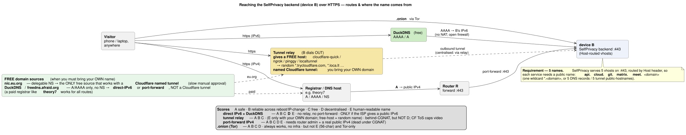

# Network setups (`--on`)

States how the installation is done w.r.t. the network setup.


## vm-local
VirtualBox VM on this host (`build-and-run.sh`). No external wiring.

---

## lan-setup-0* — direct cabl to target, no router, netboot install
```
+--------+  ethernet   +--------+
| laptop |------------>| target |   target: 192.168.100.x
+--------+             +--------+
```
Install is identical over the cable. Variants differ only in the target's **post-install**
connectivity:

| id | after install, the cable is… | wifi config |
|----|------------------------------|-------------|
| lan-setup-0a | replugged into router R → target gets its IP from R | none |
| lan-setup-0b | replugged into router R → target gets its IP from R | + wifi for **the same router R** |
| lan-setup-0c | replugged into router R → target gets its IP from R | + wifi for **a different router B** |
| lan-setup-0d | **removed** → target runs **wifi only** | wifi that reaches the internet |

---

## lan-setup-1 — laptop on R's wifi, target wired to R
*(needs R set up for netboot)*
```
+--------+ wifi  +----------+ ethernet +--------+
| laptop |------>| router R |--------->| target |
+--------+       +----------+          +--------+
```

## lan-setup-2 — laptop + target both on R's wifi
*(needs R set up for netboot)*
```
+--------+ wifi  +----------+  wifi  +--------+
| laptop |------>| router R |------->| target |
+--------+       +----------+        +--------+
```

---

## usb-0* — installer USB → target internal disk (manual boot), no laptop link
```
+-----+   +--------+
| USB |-->| target |   target: cabled into router R
+-----+   +--------+
```
All boot the same from USB. Variants differ only in connectivity:

| id | wired | wifi config |
|----|-------|-------------|
| usb-0a | LAN cable into R (internet via cable) | none |
| usb-0b | LAN cable into R (internet via cable) | + wifi for **the same router R** |
| usb-0c | LAN cable into R (internet via cable) | + wifi for **a different router B** |


# Tunneling

After device **B** (the backend) is installed it must be reachable over **https** from the open
internet. The hard part: B usually sits behind NAT (often CGNAT / a third party's router), so there
is no inbound port to forward. The routes, and how each scores on **A** safe / **B** reliable across
reboots+IP-changes / **C** free / **D** non-centralised / **E** human-readable name:


<!-- source: docs/tunneling.puml → rendered to docs/tunneling.svg by docs/render-diagrams.sh (edit the .puml, not the .svg) -->

| route | A | B | C | D | E | grandma-proof? |
|-------|---|---|---|---|---|----------------|
| Cloudflare tunnel + custom domain | ++ hidden origin+WAF | ++ IP-independent | + | -- all traffic via CF; ToS §2.8 caps video/large files | + needs a domain | ~ paste 1 token |
| quick / ngrok / pinggy / localtunnel | + | -- random URL resets | + | -- | -- random host | throwaway only |
| **direct IPv6 + dynamic DNS** | + | ++ AAAA auto-updates | + | ++ just DNS, no relay | + | **+ if ISP gives IPv6** |
| port-forward IPv4 + dynamic DNS | + | + A auto-updates | + | + | + | -- router admin; CGNAT-dead |
| onion (tor) | ++ | ++ | + | ++ | -- 56-char | ~ Tor-only |

**No single route wins A–E, is grandma-proof, AND reaches every visitor.** Decentralised + reliable
+ no-port-forward is only physically possible **over IPv6** (no NAT to cross). So:

- **Preferred (decentralised):** direct IPv6 — `grandma-1.duckdns.org → AAAA → B:443`, free, human
  readable, survives reboots (dynamic AAAA), cert via Let's Encrypt **DNS-01**, zero router config.
  Only works when B *and* the visitor both have IPv6.
- **Fallback (universal, centralised):** a Cloudflare tunnel — works behind CGNAT for any visitor, at
  the cost of routing through Cloudflare (D) and the media ToS caveat.
- **Always-on default:** onion. Never rely on a relay *you* run (single point of failure + target).

Product direction: **auto-detect and tier** — try direct IPv6, else Cloudflare tunnel, onion always up.

## Free human-readable domain sources
| src | you get | instant? | NS-delegable (→ CF tunnel) | A/AAAA + API (→ IPv6 / port-forward, dynamic DNS, LE DNS-01) |
|-----|---------|----------|----------------------------|-------------------------------------------------------------|
| nic.eu.org | `yourname.eu.org` | no — manual approval, days | yes | yes, once delegated |
| duckdns.org | `grandma-1.duckdns.org` | yes | no | yes (A/AAAA/TXT via token) |
| freedns.afraid.org | `name.mooo.com` etc | yes | no | yes (dynamic update) |

eu.org is the only free source delegable to Cloudflare (tunnel route); DuckDNS/afraid are the free
sources for the IPv6-direct / port-forward routes. See `tools/add-cloudflare.sh` for the implementations.