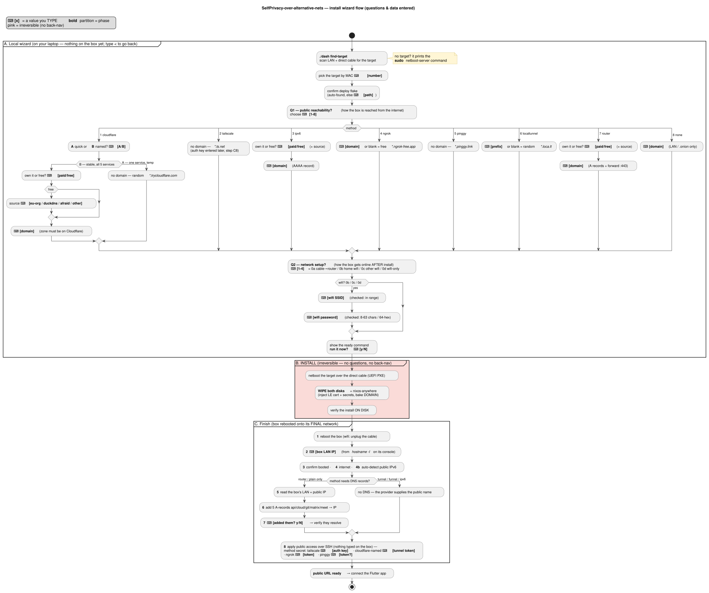

# Install wizard — setup flow

Every question the operator is asked, and every value they type, from `./dash find-target` to a live
public URL. The diagram is the tree; the tables below are the authoritative per-question detail.

Rendered from [`docs/setup-flow.puml`](docs/setup-flow.puml) by `docs/render-diagrams.sh` (pinned
plantuml — local and CI produce the same SVG). Re-render after editing the `.puml`:

```
bash docs/render-diagrams.sh
```



Legend: **⌨ [x]** = a value you type. The three phases are **A** local wizard (laptop, nothing on the
box yet — type `<` to step back one question), **B** INSTALL (irreversible, no questions), **C** finish
(box on its final network).

## Why the public-access method is asked FIRST

The chosen method **decides the domain**, and the domain is **baked into the box at install** — nginx
vhost routing (`api.`/`cloud.`/`git.`/`matrix.`/`meet.`) and the TLS cert are built around it, and
Matrix's `server_name` is immutable after first init. So the method + domain are settled up-front in
phase A (via `add-cloudflare.sh --plan`, which touches no box), flow through install as `PUBLIC_*`
env, and are *applied* on the box in phase C step 8.

## Phase A — local wizard (`tools/resolve_flake.sh` + `add-cloudflare.sh --plan`)

| # | Question | Input | Validation / default |
|---|----------|-------|----------------------|
| — | `./dash find-target` | — | scans LAN + direct cable; if the direct-cabled target is absent it prints the `sudo bash ~/netboot/start-netboot-server.sh` hint |
| A1 | pick the target | **[number]** | must match a listed candidate (by the MAC on the target's screen) |
| A2 | deploy flake | **[path]** | auto-found (the folder whose `flake.nix` has `nixosConfigurations.box`); only asked if 0 or >1 found |
| A3 | **public reachability** | **[1-8]** or name | one of cloudflare / tailscale / ipv6 / ngrok / pinggy / localtunnel / router / none |
| A4 | domain sub-questions | *method-specific* | see table below |
| A5 | **network setup** | **[1-4]** or `0a/0b/0c/0d` | empty = 1 (0a, cable→router); never silently defaults otherwise |
| A6 | wifi SSID | **[SSID]** | non-empty; a scan warns if not in range (only asked for 0b/0c/0d) |
| A7 | wifi password | **[psk]** (hidden) | WPA/WPA2 = 8-63 chars or 64-hex; verified on a spare radio if one is free |
| A8 | run it now? | **[y/N]** | empty = no; the disk wipe is confirmed by the install itself |

### A4 — domain, per method

| Method | Asks | Domain baked | Public name comes from |
|--------|------|--------------|------------------------|
| **cloudflare** | A/B; if B: paid/free (+source); **[domain]** | A→`selfprivacy.box`, B→your domain | A: random `*.trycloudflare.com`; B: your domain (zone on Cloudflare) |
| **tailscale** | *nothing* | `selfprivacy.box` | `*.ts.net` (stable, valid cert) — **auth key** typed in C8 |
| **ipv6** | paid/free (+source); **[domain]** | your domain | AAAA → box's public IPv6 |
| **ngrok** | **[domain]** or blank | blank→`selfprivacy.box` | blank: `*.ngrok-free.app`; else your domain |
| **pinggy** | *nothing* | `selfprivacy.box` | `*.pinggy.link` |
| **localtunnel** | **[prefix]** or blank | `selfprivacy.box` | `*.loca.lt` |
| **router** | paid/free (+source); **[domain]** | your domain | A records → public IP + forward :443 |
| **none** | **[domain]** | your domain (or flake default) | LAN / `.onion` only |

Free-domain **source** (when "free" is chosen): `eu-org` (delegable NS → works with tunnels **and**
router; slow manual approval), `duckdns` / `afraid` (instant, A/AAAA only — router/IPv6, **not** a
Cloudflare tunnel), or `other` (a domain you already control).

> **Single-hostname caveat.** tailscale, cloudflare-*quick*, ngrok-free, pinggy and localtunnel each
> give **one** hostname → only the **API/app** is reachable publicly. The full 5-subdomain suite needs
> a real domain + a Cloudflare **named** tunnel (B) or a router port-forward.

## Phase B — INSTALL (`tools/e2e_install_native_ethernet.sh`) — no questions

Netboot the target (UEFI PXE over the direct cable) → **wipe both disks** + `nixos-anywhere` (inject
the LE cert + secrets, bake `DOMAIN`) → verify the install on disk. Irreversible; there is no
back-navigation past A8.

## Phase C — finish (`tools/finish_box_setup.sh`) — box on its final network

| Step | Question / action | Input |
|------|-------------------|-------|
| 1 | reboot the box (wifi: unplug the install cable) | press ENTER when rebooting |
| 2 | box LAN IP | **[192.168.x.x]** from `hostname -I` on its console |
| 3 / 4 / 4b | confirm booted · verify internet · auto-detect public IPv6 | — |
| 5-7 | **only if the method needs DNS** (router / plain): read IPs → add 5 A-records → **[added? y/N]** then verify they resolve | **[y/N]** |
| 8 | apply public access over SSH (nothing typed on the box) | method secret: tailscale **[auth key]** · cloudflare-named **[tunnel token]** · ngrok **[token]** · pinggy **[token?]** |

Tunnel/funnel/ipv6 methods **skip 5-7** entirely — the provider supplies the public name, so there are
no A-records to add.

> **Typos are recoverable.** The step-2 box-IP prompt validates all four octets are `0-255` and, on a
> malformed entry (e.g. `192.168.1`), **re-asks in place** rather than dropping the whole finish flow.
> With no terminal (CI) it fails clearly instead of looping.

### Step 8, method = tailscale — getting the auth key

This is the one place a first-timer can stall, so `add-cloudflare.sh` prints the steps inline at the
prompt. To get the key the operator (on the **laptop**, not the box):

1. Open <https://login.tailscale.com/admin/settings/keys>. No account yet → **Get started / Sign up**
   (free; log in with Google / GitHub / Microsoft / email), which lands on that same Keys page.
2. **Generate auth key…** → leave every option at its default → **Generate key**.
3. **Copy** the key (starts with `tskey-auth-`, shown only once).
4. **Paste** it at the `▸ paste the Tailscale auth key …` prompt and press Enter.

**Generate a NEW key for every setup.** Tailscale auth keys are **single-use** by default — spent the
instant a box joins. A key can't be validated offline, so the script verifies it the only real way: it
tries to join and checks the box reaches `Running`. A bad/spent key is caught immediately and it
re-asks in place (no need to re-run) with a loud reminder to generate a fresh key (or tick **Reusable**
when generating if you'll set up several boxes). Re-running the apply on an *already-joined* box needs
no key at all — it keeps the existing session.

After the box joins, Funnel still has to be **switched on once for the whole tailnet** — a browser
consent only the account owner can give, so no auth key or CLI flag can do it. The script detects this,
captures the **exact pre-filled URL** Tailscale prints (`https://login.tailscale.com/f/funnel?node=…`),
shows it with click-by-click steps, and waits (press ENTER to retry, `s` to skip). You:

1. Open that link on the laptop → click **Enable Funnel** (turn on **HTTPS Certificates** too if asked).
2. Back in the terminal press **ENTER** — the script retries and brings Funnel up.

On success it prints `✓ Tailscale Funnel up: https://selfprivacy.<tailnet>.ts.net` plus the Flutter run
command (connect with `--dart-define=HTTPS_APEX=1`).

> **NixOS note.** `/etc/systemd/system` is a read-only Nix-store symlink, so `install_service` writes
> tunnel units to the writable `/run/systemd/system` and `systemctl start`s them (can't `enable`).
> They run until the next **box reboot**; re-run the step-8 apply after a reboot to bring the tunnel
> back (making tunnels reboot-persistent means baking them into the deployer flake — not yet done).
